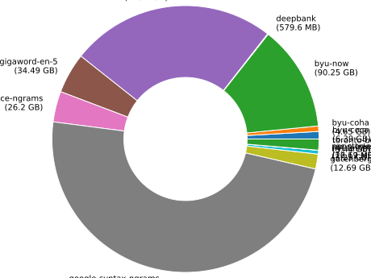

# nlp-corpora


**_A community-built high-quality repository of NLP corpora_**

This project aims to collect a shared repository of corpora useful for NLP
researchers, available inside UW.

- **Community-built** — New corpora are encouraged! Official benchmark tasks,
  large-scale recipe scrapes, collections of old novels—all are welcome.

- **High-quality** — Each corpus undergoes a vetting process to ensure it is of
  a marked version and has known state, consistent structure, and ample
  documentation. Once it is added, a corpus becomes read-only to guard against
  accidental modifications. A daily crawler indexes the full collection and
  performs several checks on every file of every corpus (browsable
  [below](#live-status)).

- **UW accessible** — All corpora live on the UW CSE department fileserver at
  `/projects/nlp-corpora/` where they enjoy automatic backups. Friends in EE,
  Linguistics, or other departments can [easily receive free
  access](#access-outside-uw-cse).

See below for a live, browsable index of all of the corpora, as well
as instructions for accessing the corpora and proposing new additions.

## Live Status

This table contains a live view of all corpora. It is updated daily by a
crawler that scans all corpora and checks that they meet quality guidelines
(immutability, access permissions, documentation, and corpus structure).

Click on any corpus to view its readme.

If the **Access** column shows a ✓, then it is open-access and ready for use.
If not, the corpus is under restricted access due to its license or terms of
use. Visit the [Restricted access](#restricted-access) section for details on
each of these corpora.

Corpus | Description | Size | [Access](#restricted-access) | Status
--- | --- | --- | --- | ---
[byu-coca](doc/byu-coca) | BYU's Corpus of Contemporary American English | 6.39 GB | [`nlpc-byu`](#restricted-access) | ✓
[byu-coha](doc/byu-coha) | BYU's Corpus of Historical American English | 4.65 GB | [`nlpc-byu`](#restricted-access) | ✓
[byu-now](doc/byu-now) | BYU's "NOW" Corpus (News On the Web) | 90.25 GB | [`nlpc-byu`](#restricted-access) | ✓
[deepbank](doc/deepbank) | Syntactic + semantic annotations on WSJ. | 579.6 MB | ✓ | ✓
[fanfiction](doc/fanfiction) | A large collection (1.25 billion lines) of fan fiction text. | 175.2 GB | ✓ | ✓
[gigaword-en-5](doc/gigaword-en-5) | English Gigaword, Fifth Edition | 34.49 GB | ✓ | ✓
[google-surface-ngrams](doc/google-surface-ngrams) | Google surface ngrams (web 1T 5-gram v1) | 26.2 GB | ✓ | ✓
[google-syntax-ngrams](doc/google-syntax-ngrams) | English Google Syntax Ngrams (v20120701) | 341.23 GB | ✓ | ✓
[gutenberg-en](doc/gutenberg-en) | All English books from Project Gutenberg | 12.69 GB | ✓ | ✓
[nyt-annotated](doc/nyt-annotated) | The New York Times Annotated Corpus | 3.25 GB | ✓ | ✓
[ontonotes](doc/ontonotes) | OntoNotes Release 5.0 | 932.92 MB | ✓ | ✓
[penn-treebank-3](doc/penn-treebank-3) | The Penn Treebank v3 (1999). | 54.1 MB | ✓ | ✓
[penn-treebank-revised](doc/penn-treebank-revised) | English News Text Treebank: Penn Treebank Revised | 16.19 MB | ✓ | ✓
[roc-stories](doc/roc-stories) | ROCStories: crowd-authored commonsense stories | 27.67 MB | ✓ | ✓
[tacred](doc/tacred) | TAC Relation Extraction Dataset | 62.08 MB | ✓ | ✓
[toronto-books](doc/toronto-books) | The Toronto BookCorpus, a large collection of books | 9.44 GB | ✓ | ✓




## Documentation

### Using the corpora

Accessing the nlp-corpora requires UW CSE department server access (e.g., to
the machines `{recycle,bicycle,tricycle}@cs.washington.edu`) so that they can
view the department filesystem. The nlp-corpora directory is located on the
department filesystem at `/projects/nlp-corpora/`. Anyone with a UW CSE account
can log onto the department servers and view the files there. (For those
without a UW CSE account, see the [access outside UW CSE
section](#access-outside-uw-cse).)

The corpora are read-only (this is enforced by our crawler) so that they stay
in a known, clean state. To work with files from the corpora, please copy them
to a local directory, e.g., with `scp`.

### Corpus structure

One of the goals of this project is to have a consistent directory structure
across all of the corpora we track to give a smooth experience browsing through
them. There is a detailed description of this structure [below](#corpus-structure).

### Adding a new corpus

Fill out this
[form](https://docs.google.com/forms/d/1SBPXlJ8zsE1kbVr6csE3d9XIaW9pCfvOkmH9kD6vEv8/viewform)
and we will work with you to add a new corpus to the repository.

### Restricted access

Some corpora require signing a form and sending it to the authoring institution
to be cleared for access. Others simply have highly restrictive licenses we
must comply with; we do so by ensuring each users reads the agreement we signed
when purchasing the corpus.

To honor these contracts, we restrict access to certain corpora by narrowing
the unix group that has read privileges. For such corpora, regrettably, you
must jump through a hoop to use them.

Detailed instructions for gaining access to each restricted access corpus are
linked to in the table below.

Access | How to be added
--- | ---
`nlpc-byu` | Please follow [these instructions](doc/byu-coca#restricted-access) for gaining access to the BYU corpora.


### Access outside UW CSE

Accessing the corpora requires a UW CSE unix account. Anyone can receive a free
UW CSE guest account by having a UW CSE faculty or staff [sponsor
them](https://sponsor.cs.washington.edu/). Despite the name "sponsor," this is
absolutely _free_ for both parties. Guest accounts last up to two years and can
be renewed indefinitely. This is the way to grant NLP friends in EE and
linguistics access to nlp-corpora.


## Corpus structure

Inside the `/projects/nlp-corpora/` directory, there should only be directories
for corpora.

Each corpus directory `<name>` should have the following format:

```
<name>
├── original/
│   └── ...
├── processed/
│   └── ...
└── README.md
```

No other top-level contents in the corpus directory is allowed.

Each of the components should be as follows:

### `original/`

_Optional_

The `original/` subdirectory should contain the source material in the most
raw, unprocessed form possible. If the source material was downloaded as a
tarball, it should be that tarball. If it was downloaded as a set of files
comprising a dataset, it should be those files. If it was scraped from a
website, it should be the raw output of the scraping command (e.g., `curl` or
`wget`).

This may not exist for all corpora, but it is preferred to exist if possible.

### `processed/`

_Optional_

The `processed/` subdirectory should contain only subdirectories, no files.
Each subdirectory should be a succinct name for the type of processing that its
contents underwent. For example, if many text files were cleaned and joined
into one, `txt`, would be an appropriate name. If tokenization was applied,
`tkn` would be an appropriate name.

Details for all subdirectories within `processed/` must be provided in the
`README.md` file (more information on this below).

### `README.md`

_Required_

The `README.md` file is required because it provides all documentation about
the data source.

In general, it should have the following format:

```
# (tile of the corpus)

(Short description of the corpus.)

(How the corpus was acquired (including the URL or the contents of the script).)

(When the corpus was acquired.)

(For each subdirectory in "processed/" (if any exist), a description of how
that directory was created. Optimal is a script (or a link to a specific
version of a script). Also acceptable is an English description. For example,
if it was tokenized, which tokenizer was used, and which version of that
software.)
```


## Bugs / questions / contributions

For any bugs or questions, please open a GitHub issue on this repository (top
of the webpage).

To help contribute to this project, please check out the [backend
repository](https://github.com/mbforbes/nlp-corpora-backend) and open issues or
pull requests there.
